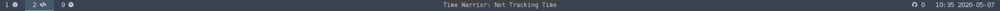

# Script: info-timewarrior

Displays current Time Warrior status




## Dependencies

* [Time Warrior](https://timewarrior.net/)
* [GNU date](http://www.gnu.org/software/coreutils/date)
* [jq](https://github.com/stedolan/jq/)

## Configuration

{ Perhaps a few words about the configuration, if necessary }


## Module

```ini
[module/info-timewarrior]
type = custom/script
exec = ~/polybar-scripts/info-timewarrior.sh
interval = 2
format-prefix = "Time Warrior: "
format-foreground = ${xrdb:color3:#4C566A}
...
```
